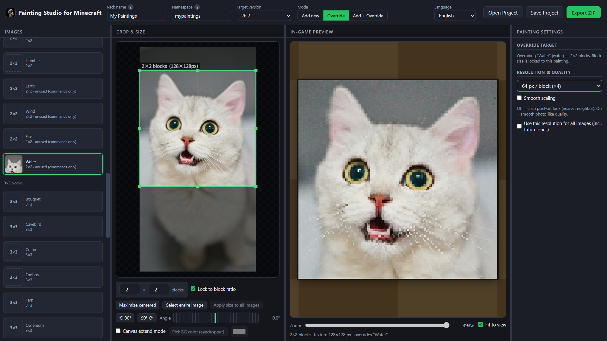

# Painting Studio for Minecraft

A fully browser-based tool for creating custom painting resource packs and data packs for Minecraft. Simply drag and drop your image files, intuitively crop them, and export a ready-to-use ZIP file for your game.

##  Features

* **Fully browser-based**: Images are never sent to a server. Everything is processed safely and locally on your device.
* **3 Flexible Modes**:
    * **Add new**: Add completely new paintings while keeping vanilla paintings intact (exports Resource Pack + Data Pack).
    * **Override vanilla**: Replace the textures of existing vanilla paintings (exports Resource Pack only).
    * **Add + Override**: Perform both actions simultaneously.
* **Advanced Image Editor**: Edit your images while viewing an in-game preview. Includes features like locking to a block aspect ratio, free rotation, and canvas extend mode.
* **Project Saving**: Save and load your workspace as a `.mcpaint` file to resume your progress at any time.
* **Multilingual Support**: The UI is available in both English and Japanese.

##  Compatibility

* Minecraft Java Edition 1.21 and above
* *Note: Supports the painting "title and author" tooltips introduced in 1.21.2+.*

##  How to Use

1. Open the downloaded HTML file in your web browser.
2. Drag and drop the images (PNG / JPG / WebP / GIF) you want to add or override into the window.
3. Adjust the block size and crop position in the center editor panel. Make sure to also set your target game version.
4. Click the "Export ZIP" button in the top right corner to download.
5. Extract the ZIP file. Move the `resourcepack` folder into your Minecraft `resourcepacks` folder, and the `datapack` folder into your world's `datapacks` folder. You can rename these folders to whatever you like.

## Support

This tool is completely free and open-source. If you like this project and want to support future updates and new features, a coffee would mean the world to me!

Not an official Minecraft product. Not approved by or associated with Mojang or Microsoft.
